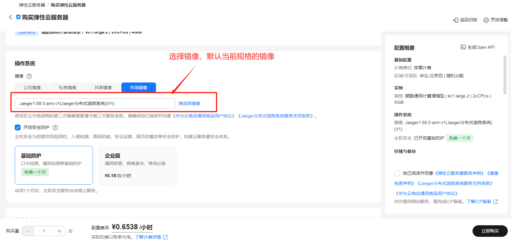
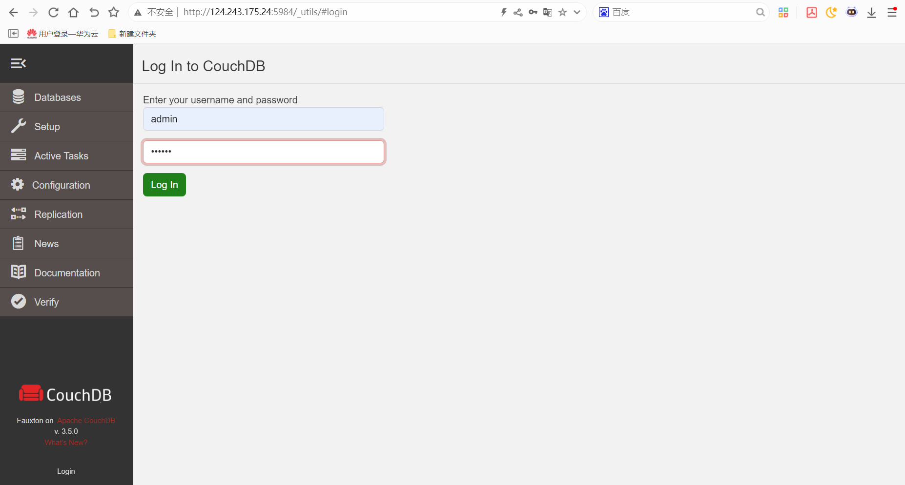
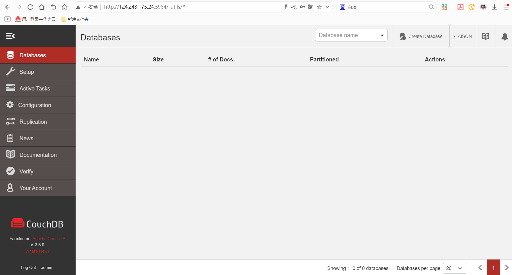

# CouchDB数据库使用指南

# 一、商品链接

[CouchDB数据库]()

# 二、商品说明

Apache CouchDB 是一款由 Apache 软件基金会维护的 开源分布式文档数据库，基于 NoSQL（非关系型） 架构设计，核心特点是 高可用性、高容错性和灵活的数据模型，尤其适合需要分布式存储和离线数据同步的场景。

# 三、商品购买

您可以在云商店搜索 **CouchDB数据库**。

其中，地域、规格、推荐配置使用默认，购买方式根据您的需求选择按需/按月/按年，短期使用推荐按需，长期使用推荐按月/按年，确认配置后点击“立即购买”。

# 3.1ECS 控制台配置

### 准备工作

在使用ECS控制台配置前，需要您提前配置好 **安全组规则**。

> **安全组规则的配置如下：**
> - 入方向规则放通端口5984，源地址内必须包含您的客户端ip，否则无法访问
> - 入方向规则放通 CloudShell 连接实例使用的端口 `22`，以便在控制台登录调试
> - 出方向规则一键放通

### 创建ECS

前提工作准备好后，选择 ECS 控制台配置跳转到[购买ECS](https://support.huaweicloud.com/qs-ecs/ecs_01_0103.html) 页面，ECS 资源的配置如下图所示：

选择CPU架构

选择服务器规格

选择镜像

其他参数根据实际请客进行填写，填写完成之后，点击立即购买即可

> **值得注意的是：**
> - VPC 您可以自行创建
> - 安全组选择 [**准备工作**](#准备工作) 中配置的安全组；
> - 弹性公网IP选择现在购买，推荐选择“按流量计费”，带宽大小可设置为5Mbit/s；
> - 高级配置需要在高级选项支持注入自定义数据，所以登录凭证不能选择“密码”，选择创建后设置；
> - 其余默认或按规则填写即可。

# 商品使用

## CouchDB数据库使用

IP+5984访问UI
用户名：admin
密码：123456

### 参考文档
[Memcached官网](https://www.memcached.org/)
